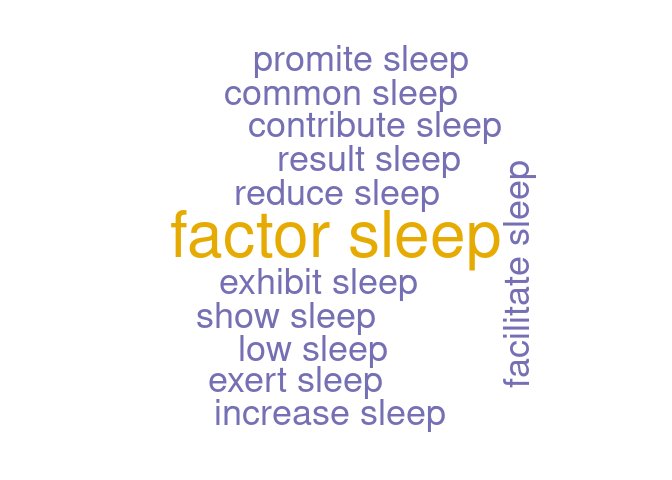
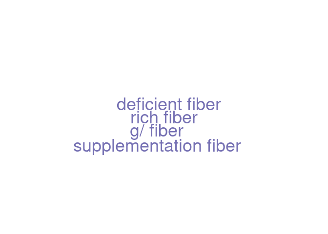

Dependencies parsing on pubmed abstract
================

``` r
library(pubmedR)
library(udpipe)
library(wordcloud)
```

    ## Loading required package: RColorBrewer

## Functions

``` r
got_abstract <- function(query) {
  res <- pmQueryTotalCount(query = query, api_key = api_key)
  print(res$total_count)
  
  D <- pmApiRequest(query = query, limit = res$total_count, api_key = NULL)
  
  #From the xml-structured object to a “classical” data frame
  D <- pmApiRequest(query = query, limit = res$total_count, api_key = NULL)
  
  M <- pmApi2df(D)
  str(M)
  texts<-M$AB
  
  return(texts)
}
```

``` r
pipeline_abstract <- function(texts) {
  texts<-tolower(texts) #required first for stopwords lol
  abstracts<-data.frame("abstracts"=texts, "doc_id"=c(1:length(texts)))
  colnames(abstracts)
  return(abstracts)
}
```

``` r
ud_model <- udpipe_download_model(language = "english-gum")
```

    ## Downloading udpipe model from https://raw.githubusercontent.com/jwijffels/udpipe.models.ud.2.5/master/inst/udpipe-ud-2.5-191206/english-gum-ud-2.5-191206.udpipe to /home/erolland/Bureau/Mining_pubmed_abstract/english-gum-ud-2.5-191206.udpipe

    ##  - This model has been trained on version 2.5 of data from https://universaldependencies.org

    ##  - The model is distributed under the CC-BY-SA-NC license: https://creativecommons.org/licenses/by-nc-sa/4.0

    ##  - Visit https://github.com/jwijffels/udpipe.models.ud.2.5 for model license details.

    ##  - For a list of all models and their licenses (most models you can download with this package have either a CC-BY-SA or a CC-BY-SA-NC license) read the documentation at ?udpipe_download_model. For building your own models: visit the documentation by typing vignette('udpipe-train', package = 'udpipe')

    ## Downloading finished, model stored at '/home/erolland/Bureau/Mining_pubmed_abstract/english-gum-ud-2.5-191206.udpipe'

``` r
ud_model <- udpipe_load_model(ud_model$file_model)
```

## Query and abstract collection

``` r
query <- "breakfast*[Title/Abstract] AND sleep*[Title/Abstract] AND english[LA] AND Journal Article[PT]"
api_key = NULL
```

``` r
texts<-got_abstract(query)
```

    ## [1] 536
    ## Documents  200  of  536 
    ## Documents  400  of  536 
    ## Documents  536  of  536 
    ## Documents  200  of  536 
    ## Documents  400  of  536 
    ## Documents  536  of  536 
    ## ================================================================================
    ## 'data.frame':    535 obs. of  30 variables:
    ##  $ AU       : chr  "CURRENTI W;GODOS J;CASTELLANO S;CARUSO G;FERRI R;CARACI F;GROSSO G;GALVANO F" "SHIRVANI N;GHAFFARI M;RAKHSHANDEROU S" "LEE SJ;CARTMELL KB" "WU AC;RAUH MJ;DELUCA S;LEWIS M;ACKERMAN KE;BARRACK MT;HEIDERSCHEIT B;KRABAK BJ;ROBERTS WO;TENFORDE AS" ...
    ##  $ AF       : chr  "CURRENTI, WALTER;GODOS, JUSTYNA;CASTELLANO, SABRINA;CARUSO, GIUSEPPE;FERRI, RAFFAELE;CARACI, FILIPPO;GROSSO, GI"| __truncated__ "SHIRVANI, NASRIN;GHAFFARI, MOHTASHAM;RAKHSHANDEROU, SAKINEH" "LEE, SU JUNG;CARTMELL, KATHLEEN B" "WU, ALEXANDER C;RAUH, MITCHELL J;DELUCA, STEPHANIE;LEWIS, MARGO;ACKERMAN, KATHRYN E;BARRACK, MICHELLE T;HEIDERS"| __truncated__ ...
    ##  $ TI       : chr  "TIME-RESTRICTED FEEDING IS ASSOCIATED WITH MENTAL HEALTH IN ELDERLY ITALIAN ADULTS." "BREAKFAST CONSUMPTION-RELATED PERCEIVED BEHAVIOUR CONTROL AND SUBJECTIVE NORMS AMONG GIRL ADOLESCENTS: APPLYING"| __truncated__ "AN ASSOCIATION RULE MINING ANALYSIS OF LIFESTYLE BEHAVIORAL RISK FACTORS IN CANCER SURVIVORS WITH HIGH CARDIOVA"| __truncated__ "RUNNING-RELATED INJURIES IN MIDDLE SCHOOL CROSS COUNTRY RUNNERS: PREVALENCE AND CHARACTERISTICS OF COMMON INJURIES." ...
    ##  $ SO       : chr  "CHRONOBIOLOGY INTERNATIONAL" "JOURNAL OF EDUCATION AND HEALTH PROMOTION" "JOURNAL OF PERSONALIZED MEDICINE" "PM & R : THE JOURNAL OF INJURY, FUNCTION, AND REHABILITATION" ...
    ##  $ SO_CO    : chr  "ENGLAND" "INDIA" "SWITZERLAND" "UNITED STATES" ...
    ##  $ LA       : chr  "ENG" "ENG" "ENG" "ENG" ...
    ##  $ DT       : chr  "JOURNAL ARTICLE" "JOURNAL ARTICLE" "JOURNAL ARTICLE" "JOURNAL ARTICLE" ...
    ##  $ DE       : chr  "MEDITERRANEAN;TIME-RESTRICTED FEEDING;AGING;BRAIN DISEASES;CHRONONUTRITION;COHORT;INTERMITTENT FASTING;MENTAL HEALTH" "ADOLESCENTS;BREAKFAST;FEMALE;PERCEIVED BEHAVIOUR CONTROL;SUBJECTIVE NORM'S" "ASSOCIATION RULE MINING;CANCER SURVIVOR;CARDIOVASCULAR DISEASE;HEALTH RISK ASSESSMENT;LIFESTYLE RISK BEHAVIOR" "" ...
    ##  $ ID       : chr  "" "" "" "" ...
    ##  $ MESH     : chr  "" "" "" "" ...
    ##  $ AB       : chr  "IN RECENT YEARS, MENTAL DISORDERS HAVE REPRESENTED A RELEVANT PUBLIC HEALTH PROBLEM DUE TO THEIR DELETERIOUS EF"| __truncated__ "HEALTHY NUTRITION IN CHILDHOOD AND ADOLESCENCE IS IMPORTANT FOR GROWTH AND DEVELOPMENT. BREAKFAST IS THE MOST I"| __truncated__ "WE AIMED TO ASSESS WHICH LIFESTYLE RISK BEHAVIORS HAVE THE GREATEST INFLUENCE ON THE RISK OF CARDIOVASCULAR DIS"| __truncated__ "UNDERSTANDING THE PREVALENCE AND FACTORS ASSOCIATED WITH RUNNING-RELATED INJURIES IN MIDDLE SCHOOL RUNNERS MAY "| __truncated__ ...
    ##  $ C1       : chr  "DEPARTMENT OF BIOMEDICAL AND BIOTECHNOLOGICAL SCIENCES, UNIVERSITY OF CATANIA, CATANIA, ITALY.;OASI RESEARCH IN"| __truncated__ "MSC OF HEALTH EDUCATION AND HEALTH PROMOTION, SCHOOL OF PUBLIC HEALTH AND SAFETY, SHAHID BEHESHTI UNIVERSITY OF"| __truncated__ "RESEARCH INSTITUTE ON NURSING SCIENCE, SCHOOL OF NURSING, HALLYM UNIVERSITY, 1 HALLYMDAEHAK-GIL, CHUNCHEON-SI 2"| __truncated__ "SPAULDING REHABILITATION HOSPITAL, CHARLESTOWN MA; HARVARD MEDICAL SCHOOL, BOSTON, MA, USA.;DOCTOR OF PHYSICAL "| __truncated__ ...
    ##  $ CR       : chr  "NA" "NA" "NA" "NA" ...
    ##  $ TC       : num  0 0 0 0 0 0 0 0 0 0 ...
    ##  $ SN       : chr  "1525-6073" "2277-9531" "2075-4426" "1934-1563" ...
    ##  $ J9       : chr  "CHRONOBIOL INT" "J EDUC HEALTH PROMOT" "J PERS MED" "PM R" ...
    ##  $ JI       : chr  "CHRONOBIOL INT" "J EDUC HEALTH PROMOT" "J PERS MED" "PM R" ...
    ##  $ PY       : num  2021 2020 2021 2020 2021 ...
    ##  $ PY_IS    : chr  "2021" "2021" "2021" "2021" ...
    ##  $ VL       : chr  NA "10" "11" NA ...
    ##  $ DI       : chr  "10.1080/07420528.2021.1932998" "10.4103/jehp.jehp_474_20" "10.3390/jpm11050366" "10.1002/pmrj.12649" ...
    ##  $ PG       : chr  "1-10" "96" NA NA ...
    ##  $ GRANT_ID : chr  "" "" "HRF 202005-008" "" ...
    ##  $ GRANT_ORG: chr  "" "" "HALLYM UNIVERSITY RESEARCH FUND" "" ...
    ##  $ UT       : chr  "34100325" "34084843" "34063255" "34053194" ...
    ##  $ PMID     : chr  "34100325" "34084843" "34063255" "34053194" ...
    ##  $ DB       : chr  "PUBMED" "PUBMED" "PUBMED" "PUBMED" ...
    ##  $ AU_UN    : chr  "DEPARTMENT OF BIOMEDICAL AND BIOTECHNOLOGICAL SCIENCES, UNIVERSITY OF CATANIA, CATANIA, ITALY.;OASI RESEARCH IN"| __truncated__ "MSC OF HEALTH EDUCATION AND HEALTH PROMOTION, SCHOOL OF PUBLIC HEALTH AND SAFETY, SHAHID BEHESHTI UNIVERSITY OF"| __truncated__ "RESEARCH INSTITUTE ON NURSING SCIENCE, SCHOOL OF NURSING, HALLYM UNIVERSITY, 1 HALLYMDAEHAK-GIL, CHUNCHEON-SI 2"| __truncated__ "SPAULDING REHABILITATION HOSPITAL, CHARLESTOWN MA; HARVARD MEDICAL SCHOOL, BOSTON, MA, USA.;DOCTOR OF PHYSICAL "| __truncated__ ...
    ##  $ AU_CO    : chr  "NA" "NA" "NA" "NA" ...
    ##  $ AU1_CO   : chr  "NA" "NA" "NA" "NA" ...

``` r
abstracts<-pipeline_abstract(texts)


x <- udpipe_annotate(ud_model, x = abstracts$abstracts, doc_id = abstracts$doc_id)
x <- as.data.frame(x)

head(x)
```

    ##   doc_id paragraph_id sentence_id
    ## 1      1            1           1
    ## 2      1            1           1
    ## 3      1            1           1
    ## 4      1            1           1
    ## 5      1            1           1
    ## 6      1            1           1
    ##                                                                                                                                                                         sentence
    ## 1 in recent years, mental disorders have represented a relevant public health problem due to their deleterious effect on quality of life and the difficulty of timely diagnosis.
    ## 2 in recent years, mental disorders have represented a relevant public health problem due to their deleterious effect on quality of life and the difficulty of timely diagnosis.
    ## 3 in recent years, mental disorders have represented a relevant public health problem due to their deleterious effect on quality of life and the difficulty of timely diagnosis.
    ## 4 in recent years, mental disorders have represented a relevant public health problem due to their deleterious effect on quality of life and the difficulty of timely diagnosis.
    ## 5 in recent years, mental disorders have represented a relevant public health problem due to their deleterious effect on quality of life and the difficulty of timely diagnosis.
    ## 6 in recent years, mental disorders have represented a relevant public health problem due to their deleterious effect on quality of life and the difficulty of timely diagnosis.
    ##   token_id     token    lemma  upos xpos       feats head_token_id dep_rel deps
    ## 1        1        in       in   ADP   IN        <NA>             3    case <NA>
    ## 2        2    recent   recent   ADJ   JJ  Degree=Pos             3    amod <NA>
    ## 3        3     years     year  NOUN  NNS Number=Plur             8     obl <NA>
    ## 4        4         ,        , PUNCT    ,        <NA>             3   punct <NA>
    ## 5        5    mental   mental   ADJ   JJ  Degree=Pos             6    amod <NA>
    ## 6        6 disorders disorder  NOUN  NNS Number=Plur             8   nsubj <NA>
    ##            misc
    ## 1          <NA>
    ## 2          <NA>
    ## 3 SpaceAfter=No
    ## 4          <NA>
    ## 5          <NA>
    ## 6          <NA>

``` r
colnames(x)
```

    ##  [1] "doc_id"        "paragraph_id"  "sentence_id"   "sentence"     
    ##  [5] "token_id"      "token"         "lemma"         "upos"         
    ##  [9] "xpos"          "feats"         "head_token_id" "dep_rel"      
    ## [13] "deps"          "misc"

### Dependencie parsing

As described here : <https://bnosac.github.io/udpipe/docs/doc7.html>

``` r
merged_x <- merge(x, x, 
               by.x = c("doc_id", "paragraph_id", "sentence_id", "head_token_id"),
               by.y = c("doc_id", "paragraph_id", "sentence_id", "token_id"),
               all.x = TRUE, all.y = FALSE, 
               suffixes = c("", "_parent"), sort = FALSE)
head(merged_x)
```

    ##   doc_id paragraph_id sentence_id head_token_id
    ## 1      1            1           1             3
    ## 2      1            1           1             3
    ## 3      1            1           1             3
    ## 4      1            1           1             8
    ## 5      1            1           1             8
    ## 6      1            1           1             8
    ##                                                                                                                                                                         sentence
    ## 1 in recent years, mental disorders have represented a relevant public health problem due to their deleterious effect on quality of life and the difficulty of timely diagnosis.
    ## 2 in recent years, mental disorders have represented a relevant public health problem due to their deleterious effect on quality of life and the difficulty of timely diagnosis.
    ## 3 in recent years, mental disorders have represented a relevant public health problem due to their deleterious effect on quality of life and the difficulty of timely diagnosis.
    ## 4 in recent years, mental disorders have represented a relevant public health problem due to their deleterious effect on quality of life and the difficulty of timely diagnosis.
    ## 5 in recent years, mental disorders have represented a relevant public health problem due to their deleterious effect on quality of life and the difficulty of timely diagnosis.
    ## 6 in recent years, mental disorders have represented a relevant public health problem due to their deleterious effect on quality of life and the difficulty of timely diagnosis.
    ##   token_id     token    lemma  upos xpos                            feats
    ## 1        2    recent   recent   ADJ   JJ                       Degree=Pos
    ## 2        4         ,        , PUNCT    ,                             <NA>
    ## 3        1        in       in   ADP   IN                             <NA>
    ## 4        7      have     have   AUX  VBP Mood=Ind|Tense=Pres|VerbForm=Fin
    ## 5        3     years     year  NOUN  NNS                      Number=Plur
    ## 6        6 disorders disorder  NOUN  NNS                      Number=Plur
    ##   dep_rel deps          misc
    ## 1    amod <NA>          <NA>
    ## 2   punct <NA>          <NA>
    ## 3    case <NA>          <NA>
    ## 4     aux <NA>          <NA>
    ## 5     obl <NA> SpaceAfter=No
    ## 6   nsubj <NA>          <NA>
    ##                                                                                                                                                                  sentence_parent
    ## 1 in recent years, mental disorders have represented a relevant public health problem due to their deleterious effect on quality of life and the difficulty of timely diagnosis.
    ## 2 in recent years, mental disorders have represented a relevant public health problem due to their deleterious effect on quality of life and the difficulty of timely diagnosis.
    ## 3 in recent years, mental disorders have represented a relevant public health problem due to their deleterious effect on quality of life and the difficulty of timely diagnosis.
    ## 4 in recent years, mental disorders have represented a relevant public health problem due to their deleterious effect on quality of life and the difficulty of timely diagnosis.
    ## 5 in recent years, mental disorders have represented a relevant public health problem due to their deleterious effect on quality of life and the difficulty of timely diagnosis.
    ## 6 in recent years, mental disorders have represented a relevant public health problem due to their deleterious effect on quality of life and the difficulty of timely diagnosis.
    ##   token_parent lemma_parent upos_parent xpos_parent             feats_parent
    ## 1        years         year        NOUN         NNS              Number=Plur
    ## 2        years         year        NOUN         NNS              Number=Plur
    ## 3        years         year        NOUN         NNS              Number=Plur
    ## 4  represented    represent        VERB         VBN Tense=Past|VerbForm=Part
    ## 5  represented    represent        VERB         VBN Tense=Past|VerbForm=Part
    ## 6  represented    represent        VERB         VBN Tense=Past|VerbForm=Part
    ##   head_token_id_parent dep_rel_parent deps_parent   misc_parent
    ## 1                    8            obl        <NA> SpaceAfter=No
    ## 2                    8            obl        <NA> SpaceAfter=No
    ## 3                    8            obl        <NA> SpaceAfter=No
    ## 4                    0           root        <NA>          <NA>
    ## 5                    0           root        <NA>          <NA>
    ## 6                    0           root        <NA>          <NA>

stats changed to merged\_x, so I can run different subset without
recreating stats everytime.

``` r
vector_of_interest<-c("sleep")
stats <- subset(merged_x, dep_rel %in% "nsubj" & token %in% vector_of_interest)

display_dependencies <- function(stats) {
  stats$term <- paste(stats$lemma_parent, stats$lemma, sep = " ")
  stats <- txt_freq(stats$term)
  wordcloud(words = stats$key, freq = stats$freq, min.freq = 3, max.words = 100,
            random.order = FALSE, colors = c("#1B9E77", "#D95F02", "#7570B3", "#E7298A", "#66A61E", "#E6AB02"))
}


display_dependencies(stats)
```

    ## Warning in wordcloud(words = stats$key, freq = stats$freq, min.freq = 3, :
    ## deprive sleep could not be fit on page. It will not be plotted.

    ## Warning in wordcloud(words = stats$key, freq = stats$freq, min.freq = 3, : occur
    ## sleep could not be fit on page. It will not be plotted.

    ## Warning in wordcloud(words = stats$key, freq = stats$freq, min.freq = 3, : take
    ## sleep could not be fit on page. It will not be plotted.

    ## Warning in wordcloud(words = stats$key, freq = stats$freq, min.freq = 3, :
    ## circadian sleep could not be fit on page. It will not be plotted.

    ## Warning in wordcloud(words = stats$key, freq = stats$freq, min.freq = 3, :
    ## confirm sleep could not be fit on page. It will not be plotted.

<!-- -->

``` r
vector_of_interest<-c("sleep")
stats <- subset(merged_x, token %in% vector_of_interest)
display_dependencies(stats)
```

<!-- -->

``` r
vector_of_interest<-c("fiber")
stats <- subset(merged_x, token %in% vector_of_interest)
display_dependencies(stats)
```

    ## Warning in wordcloud(words = stats$key, freq = stats$freq, min.freq = 3, :
    ## supplement fiber could not be fit on page. It will not be plotted.

    ## Warning in wordcloud(words = stats$key, freq = stats$freq, min.freq = 3, :
    ## better-tolerate fiber could not be fit on page. It will not be plotted.

<!-- -->
